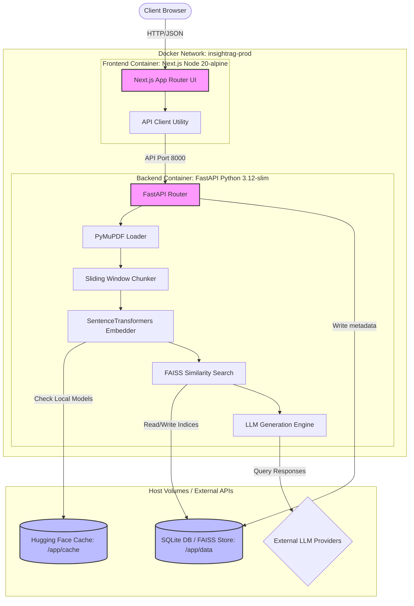

# InsightRAG

<p align="center">
  <strong>AI-powered Retrieval-Augmented Generation (RAG) platform built with FastAPI, Next.js, Docker, and modern DevOps practices.</strong>
</p>

<p align="center">
  <!-- Static Badges -->
  
  
  
  
  
  
  
</p>

---

## 📈 Deployed Status & CI/CD Placeholders
*Note: The following pipeline status integrations will be enabled dynamically after subsequent phases:*
```text
[Build Status Badge Placeholder]  [Container Registry Push Badge Placeholder]  [Railway Deployment Status Badge Placeholder]  [Security Scan Status Badge Placeholder]
```

---

## 📖 Overview

InsightRAG is a production-grade, modular Retrieval-Augmented Generation (RAG) platform designed to ingest complex technical PDFs, chunk text using sliding windows, generate vector embeddings, and search them via cosine similarity. It provides natural language chatbot interactions with grounded context, backed by exact page-level source citations.

---

## 🖥️ Demo & Screenshots

Below are placeholders for the UI interfaces and visualizations. Refer to [docs/images/README.md](file:///c:/Users/hp5cd/Desktop/rag/docs/images/README.md) for local file mapping:

| Interface | Visualization |
| :--- | :--- |
| **Main Dashboard & Uploads** | <br>*Enables drag-and-drop document uploads and status tracking.* |
| **Document Chatbot** | <br>*Conversational AI querying with grounded inline citations and source snippet modals.* |
| **Document Management** | <br>*View processing statuses, index summaries, and delete documents.* |

---

## ✨ Features

### Product Features
- ✓ **Instant Document Parsing**: Ingests multi-page PDFs, preserving exact 1-indexed page boundaries for accurate referencing.
- ✓ **Slide Window Chunker**: Implements configurable text splitting with custom overlaps to maintain semantic continuity.
- ✓ **Dense Vector Embedding**: Embeds chunks locally using the optimized `all-MiniLM-L6-v2` transformer model.
- ✓ **Cos-Similarity Vector Indexing**: Manages vector space flat indices with metadata mappings and disk persistence.
- ✓ **Multi-Provider LLM Integration**: Supports **OpenAI**, **Groq (Llama 3)**, **Google Gemini**, **Ollama**, and a **Built-in Offline Provider** for out-of-the-box operation.
- ✓ **Modern SaaS UI**: Implements a clean web dashboard with dark mode support, drag-and-drop file inputs, and interactive components.

### Engineering Features
- ✓ **Multi-Stage Production Builds**: Uses lean runner images to compile and export assets while isolating compiler tools.
- ✓ **Python 3.12 & Node 20 Upgrades**: Runs on modern language runtimes for runtime speed improvements.
- ✓ **Non-Root Execution**: Runs all services under restricted system users (`backend` and `nextjs`) for container hardening.
- ✓ **BuildKit Dependency Caching**: Speeds up GHA/local builds using pip and npm BuildKit cache mounts.
- ✓ **Model Cache Persistence**: Resolves startup cold-starts by loading Hugging Face models from local volume mounts.
- ✓ **Dynamic Port Binding**: Auto-detects and binds ports at boot to comply with Railway container assignments.
- ✓ **Container Health Checks**: Features inline container health checks for liveness and readiness monitoring.
- ✓ **Development Hot-Reloading**: Provides synchronized development containers with polling-based hot reload.

---

## 🏗️ Architecture

InsightRAG is split into isolated services running within a Docker network. Persistent state is volume-mounted to preserve databases, FAISS vector indices, and Hugging Face model downloads.



---

## 🛠️ Technology Stack

| Layer | Technology | Purpose |
| :--- | :--- | :--- |
| **Frontend** | Next.js 14.2.5 (React 18 / TypeScript) | Component-driven user interface and API caller. |
| **Styling** | Tailwind CSS | Utility-first custom design theme and animations. |
| **Backend** | FastAPI (Python 3.12) | REST API endpoints, async handlers, and database interfaces. |
| **Database** | SQLite & SQLAlchemy | Persistent store for document metadata and processing states. |
| **PDF Extraction**| PyMuPDF (fitz) | Fast page-by-page text parser. |
| **Embeddings** | SentenceTransformers (all-MiniLM-L6-v2) | Local 384-dimensional dense semantic embedding generation. |
| **Vector Store** | FAISS-CPU (Facebook AI Similarity Search) | Cosine similarity index management and storage. |
| **Containerization**| Docker & Docker Compose | Uniform runtime packaging for development and production. |

---

## 📂 Project Structure

Below is an overview of the key directories in the repository:

```text
insightrag/
 ├── .github/
 │    ├── ISSUE_TEMPLATE/    # GitHub Issue Markdown forms (bugs, features, Q&A)
 │    ├── CODEOWNERS         # Core repository review assignment settings
 │    └── pull_request_template.md # PR formatting template
 ├── backend/
 │    ├── api/               # FastAPI routers (chat, upload, settings, health)
 │    ├── cache/             # Local volume mount for Hugging Face cache (Git ignored)
 │    ├── core/              # Central configuration and structured log setup
 │    ├── database/          # SQLite database connection and structures
 │    ├── models/            # Pydantic validation schemas
 │    ├── rag/               # Core pipeline modules (chunker, retriever, generator)
 │    └── tests/             # Pytest automated testing suite
 ├── frontend/
 │    ├── src/
 │    │    ├── app/          # Next.js App Router routing layouts
 │    │    ├── components/   # UI layouts (Cards, Upload inputs, Chat dialogue modals)
 │    │    └── lib/          # Typed API helper client
 │    └── next.config.js     # Next.js server configuration (standalone output)
 ├── docker/
 │    ├── Dockerfile.backend.dev # Backend development build (reload enabled)
 │    ├── Dockerfile.backend.prod # Backend production build (multi-stage)
 │    ├── Dockerfile.frontend.dev # Frontend development build (npm dev run)
 │    └── Dockerfile.frontend.prod # Frontend production build (Next.js standalone)
 ├── docs/
 │    ├── images/            # Documentation images and screenshots
 │    ├── architecture.md    # API and ingestion architecture deep-dive
 │    └── learning_notes.md  # Vector database, math, and chunking trade-offs
 ├── docker-compose.dev.yml  # Dev compose setup with hot-reloading
 └── docker-compose.prod.yml # Production compose configuration
```

---

## ⚡ Getting Started

Ensure you have [Docker](https://www.docker.com/) installed on your machine.

### Single-Command Start (Production Mode)

1. Create a `.env` file in the root directory based on the template:
   ```bash
   cp .env.example .env
   ```
2. Populate `.env` with your API keys (optional; the platform can run offline using the mock/offline engine).
3. Start the production stack:
   ```bash
   docker compose -f docker-compose.prod.yml up -d
   ```
4. Access the applications:
   - **Frontend**: [http://localhost:3000](http://localhost:3000)
   - **Backend Documentation**: [http://localhost:8000/docs](http://localhost:8000/docs)

---

## 🛠️ Development Workflow

The local development environment is optimized for hot-reloading. File edits to Python backend files or Next.js components are detected immediately inside the containers via file poll-watchers.

- Start development mode:
  - **Windows (PowerShell)**: `.\scripts\dev.ps1`
  - **Unix (Bash)**: `./scripts/dev.sh`
  - **Direct Command**: `docker compose -f docker-compose.dev.yml up`
- Database, uploaded uploads, and indices are preserved under `./backend/data`.

To run automated tests locally:
```bash
cd backend
python -m venv venv
source venv/bin/activate  # or activate.ps1
pip install -r requirements.txt
pytest -v
```

---

## 🚀 Production Optimization

The production images are engineered for speed, minimal size, and container security:
1. **Multi-Stage Compilation**: Removes GCC compilers and node modules, packing only the static site and pre-compiled Python libraries.
2. **CPU-only Optimization**: Drops PyTorch size by installing CPU-specific wheels, reducing backend footprint by **over 2 GB**.
3. **Non-Root Execution**: Runs under system users with restricted security permissions inside alpine/slim runtimes.
4. **Hugging Face Model Caching**: Saves model weights to `./backend/cache/huggingface` to ensure fast restarts and prevent model downloads on Railway scale-ups.

---

## 🗺️ Project Roadmap

- [x] **Phase 1**: Local Development Setup (Hot Reloading, SQLite volumes)
- [x] **Phase 2**: Production Docker Optimization (Multi-stage builds, CPU PyTorch, non-root users)
- [x] **Phase 2.0.5**: Repository Hardening (Guidelines, templates, README redesign)
- [ ] **Phase 2.1**: GitHub Actions (CI automated build tests)
- [ ] **Phase 2.2**: GitHub Container Registry (Automated Docker pushes)
- [ ] **Phase 2.3**: Railway Deployment (Production hosting integration)
- [ ] **Phase 2.4**: Security & Monitoring (Auto-CVE scanning, logging)
- [ ] **Phase 3**: Production Scaling (Distributed caches, PostgreSQL, dynamic index trees)

---

## 🤝 Contributing

We welcome contributions! Please read our [CONTRIBUTING.md](file:///c:/Users/hp5cd/Desktop/rag/CONTRIBUTING.md) for details on code style, commit formatting, and the pull request submission process.

Security vulnerabilities should be reported privately as described in our [SECURITY.md](file:///c:/Users/hp5cd/Desktop/rag/SECURITY.md).

---

## 📄 License

This project is licensed under the MIT License - see the [LICENSE](file:///c:/Users/hp5cd/Desktop/rag/LICENSE) file for details.
