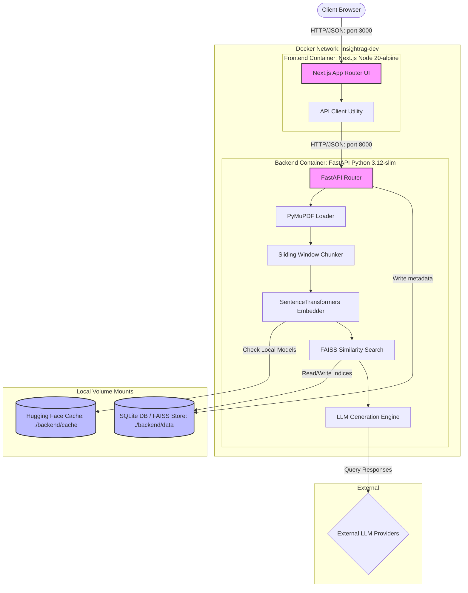
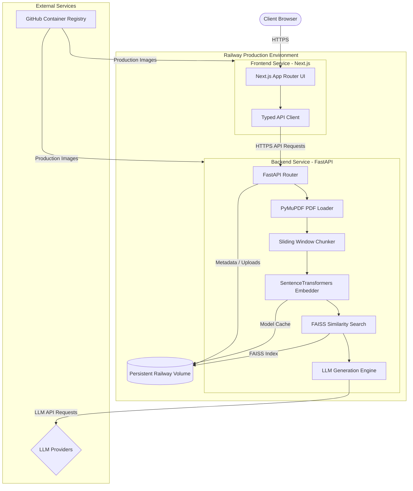

# InsightRAG

A Retrieval-Augmented Generation (RAG) engine designed for technical document research, featuring page-level source citations and document management.

**[🚀 Live Demo](https://insightrag.up.railway.app)** ·
**[📚 API Documentation](https://insightrag-backend-production.up.railway.app/docs)** ·
**[❤️ API Health](https://insightrag-backend-production.up.railway.app/healthz)**

---

## 🚀 Live Demo

- **Frontend Interface:** [https://insightrag.up.railway.app](https://insightrag.up.railway.app)
- **Backend API Base:** [https://insightrag-backend-production.up.railway.app](https://insightrag-backend-production.up.railway.app)
- **Interactive Swagger Docs:** [https://insightrag-backend-production.up.railway.app/docs](https://insightrag-backend-production.up.railway.app/docs)
- **Liveness Probe (Healthz):** [https://insightrag-backend-production.up.railway.app/healthz](https://insightrag-backend-production.up.railway.app/healthz)

---

## 📖 Overview

InsightRAG is an engineering-focused Retrieval-Augmented Generation (RAG) platform that processes technical PDF manuals, books, or papers to answer questions with verifiable inline source citations. The application extracts page-bounded text, segments it via sliding window chunking, indexes the vectors, and processes queries by passing context to a Language Model (LLM).

### Processing Workflow

```text
[PDF Upload]
     ↓
[Text Extraction] (Preserves exact page numbers via PyMuPDF)
     ↓
[Text Chunking] (Sliding window segmentation with configured overlaps)
     ↓
[Embeddings Generation] (Generates dense vectors via SentenceTransformers)
     ↓
[FAISS Indexing] (Disk-persisted cosine similarity index)
     ↓
[Retrieval & Ingestion] (Pulls top k context chunks matching the query)
     ↓
[Response Generation] (Synthesizes answer with precise source page citations)
```

---

## ✨ Features

- **Document Upload & Management**: Ingestion of multi-page PDF documents with list, state tracking, and deletion capabilities.
- **Document Processing & Chunking**: Automatic page-level parsing and sliding-window segmentation.
- **Contextual Retrieval**: Indexing and fast cosine-similarity search against local vector coordinates.
- **RAG Chat Interface**: Conversational search generating answers grounded strictly in retrieved context chunks.
- **Citation-Aware Responses**: Exact source page citations and source snippet preview dialogs.
- **FastAPI Backend Services**: Structured REST API with dynamic OpenAPI configuration and liveness/readiness probes.
- **Configuration Panel**: Local database settings management for tuning chunk size, overlap, and top-k retrieval.

---

## 🛠️ Technology Stack

### Frontend
- **Framework**: Next.js 14.2.5 (React 18 / TypeScript)
- **Styling**: Tailwind CSS
- **API Client**: Fetch-based async client utility

### Backend
- **Framework**: FastAPI (Python 3.12)
- **Database**: SQLite & SQLAlchemy ORM
- **Text Extraction**: PyMuPDF (fitz)

### AI & Vector Ingestion
- **Embeddings**: SentenceTransformers (`all-MiniLM-L6-v2` locally executed)
- **Vector Database**: FAISS (Flat IP / Cosine Similarity index)
- **LLM Integrations**: External API clients (OpenAI, Gemini, Groq) and offline mock generator

### DevOps & Delivery
- **Orchestration**: Docker & Docker Compose (development and local production compose manifests)
- **CI Build Runner**: GitHub Actions
- **Container Storage**: GitHub Container Registry (GHCR)
- **Hosting Platform**: Railway

---

## 🏗️ Technical Architecture

### Local Development Architecture (Docker Compose)
During local development, both services run within an isolated local Docker network (`insightrag-dev`). Code modifications are synchronized into the containers via host directory volume-mounts, and local cache/data paths are mapped to the local file system.



### Production Cloud Architecture (Railway)
In production, the frontend and backend operate as decoupled, standalone cloud services on Railway. The backend service mounts a single persistent Railway volume to `/app/data` to ensure all SQLite records, uploads, and model cache files survive service redeployments.



#### Architecture Components

| Component | Responsibility |
| :--- | :--- |
| **Next.js Frontend** | Serves the web-based document dashboard, file manager, and chat layout client-side. |
| **API Client** | Transmits typed HTTP requests asynchronously from client browsers to the API server. |
| **FastAPI Backend** | Listens for API requests, validates inputs using Pydantic, and interacts with database/RAG structures. |
| **PyMuPDF** | Extracts raw text from PDF files page-by-page, preserving exact 1-indexed document boundaries. |
| **Chunker** | Breaks down text contents into overlapping sentences to maintain context layout. |
| **SentenceTransformers** | Runs the `all-MiniLM-L6-v2` transformer model to generate dense semantic vector coordinates. |
| **FAISS** | Maintains the Cosine Similarity vector database, performing semantic search calculations on indices. |
| **LLM Providers** | Synthesizes response answers grounded strictly in retrieved context files (OpenAI, Gemini, Groq). |
| **Railway Volume** | 5GB persistent storage mounted at `/app/data` hosting SQLite, index files, uploads, and model weights. |
| **GHCR** | Secure storage housing production Docker images built via GitHub Actions. |

#### Production Request Flow

```text
User Action
  → Browser fetches Next.js standalone UI
  → File Upload / Chat Question submitted
  → API client invokes HTTPS call to FastAPI backend URL
  → Ingestion router runs document loader/chunker/embeddings generator
  → Query triggers FAISS vector similarity search
  → Top context segments extracted and formatted
  → Grounded context + question payload passed to LLM provider (OpenAI/Gemini/Groq)
  → Citation-backed answer generated and returned via JSON
  → Frontend parses citation page tags and displays source snippets in modals
```

---

## 📂 Repository Structure

```text
insightrag/
 ├── .github/
 │    └── workflows/         # GHA workflows (ci.yml, publish-ghcr.yml)
 ├── backend/
 │    ├── api/               # API endpoint routers (chat, documents, settings, health)
 │    ├── core/              # Logger and environment settings config
 │    ├── database/          # SQLite database connection setup and models
 │    ├── models/            # Pydantic validation schemas
 │    ├── rag/               # Chunker, embeddings, retriever, and LLM providers
 │    └── tests/             # Automated test cases (pytest)
 ├── frontend/
 │    ├── src/
 │    │    ├── app/          # Next.js App Router templates
 │    │    ├── components/   # UI cards, chats, and upload dialogs
 │    │    └── lib/          # Typed API helper clients
 │    └── next.config.js     # Next.js standalone configurations
 ├── docker/
 │    ├── Dockerfile.backend.dev  # Dev backend image (reload enabled)
 │    ├── Dockerfile.backend.prod # Prod backend image (multi-stage + entrypoint gosu drop)
 │    ├── Dockerfile.frontend.dev # Dev frontend image (npm run dev)
 │    └── Dockerfile.frontend.prod # Prod frontend image (Next.js standalone build)
 ├── docs/
 │    ├── architecture.md    # Detail pipeline structures
 │    └── learning_notes.md  # Vector space and chunking math documentation
 ├── docker-compose.dev.yml  # Local hot-reloading development compose file
 └── docker-compose.prod.yml # Local production container test file
```

---

## ⚙️ Configuration & Environment Variables

### Local Development Variables
*   Configured inside the Git-ignored `.env` file at the root directory:
    *   `PROJECT_NAME`: Custom API title (default: `InsightRAG`)
    *   `DEFAULT_LLM_PROVIDER`: Ingestion generator (default: `mock`)
    *   `OPENAI_API_KEY`, `GEMINI_API_KEY`, `GROQ_API_KEY`: Optional third-party provider keys.

### Production Build & Runtime Variables
*   Configure these in your Railway service settings:
    *   `NEXT_PUBLIC_API_URL`: Points the frontend to the backend service. Set to `https://insightrag-backend-production.up.railway.app` during the frontend build.
    *   `PORT`: Dynamic port mapping assigned automatically by Railway at startup.
    *   `HF_HOME` & `SENTENCE_TRANSFORMERS_HOME`: Set to `/app/data/huggingface` inside the backend service variables to cache models directly on the persistent volume mount.

---

## ⚡ Getting Started

### Local Development

1. Create a `.env` file in the root directory based on the template:
   ```bash
   cp .env.example .env
   ```
2. Start the hot-reloading development containers:
   ```bash
   docker compose -f docker-compose.dev.yml up
   ```
3. Open:
   - Frontend: [http://localhost:3000](http://localhost:3000)
   - API Docs: [http://localhost:8000/docs](http://localhost:8000/docs)

To run tests locally:
```bash
cd backend
python -m venv venv
source venv/bin/activate  # activate.ps1 on Windows
pip install -r requirements.txt
pytest --ignore=cache -v
```

### Local Production Testing

To build and run the production-optimized images locally:
```bash
docker compose -f docker-compose.prod.yml up -d
```

---

## 🔄 Deployment & CI/CD

The delivery pipeline is fully automated from repository to registry to cloud deployment:

```text
Developer Push to main branch
         ↓
GitHub Actions Workflow (Runs linting, imports, Next.js build, and compiles containers)
         ↓
Docker Production Images Pushed (Tagged as latest and sha-<commit>)
         ↓
GitHub Container Registry (GHCR) Storage
         ↓
Railway Registry Pull (Detects new images in GHCR via auto-update settings)
         ↓
Automatic Deployment (Pulls and spawns updated services)
```

*   **Production Backend Image**: `ghcr.io/niranjansharma-edu/insightrag-backend:latest`
*   **Production Frontend Image**: `ghcr.io/niranjansharma-edu/insightrag-frontend:latest`
*   **Continuous Integration (`ci.yml`):** Automatically validates code quality on pushes and PRs to all branches. Runs backend FastAPI import checks, frontend Next.js compilation testing, and builds Docker containers locally to verify configuration integrity.
*   **Publish Docker Images (`publish-ghcr.yml`):** Automatically builds, tags, and pushes production containers to the GitHub Container Registry (GHCR) on pushes to the `main` branch.
*   **Railway Integration:** Railway's services are linked directly to their respective GHCR images, and `Automatic Updates` are enabled ("As soon as ready"), ensuring instant updates on tag changes.

---

## 🚀 Production Optimization

The production configurations are engineered for speed, footprint optimization, and container security:
1.  **Multi-Stage Compilation:** Removes system dependencies, build tools, and node modules, packaging only Next.js standalone outputs and pre-compiled Python libraries.
2.  **CPU-only PyTorch:** Installs CPU-specific PyTorch wheels to reduce the backend Docker footprint by **over 2 GB**.
3.  **Secure Privilege Separation:** The containers boot as root, execute an entrypoint setup script (`docker-entrypoint.sh`) to pre-create and verify mount permissions, and drop privileges using `gosu` to execute server processes under non-root system accounts (`backend` and `nextjs`).
4.  **Model Cache Volume Persistence:** By directing downloads to `/app/data/huggingface` inside the persistent volume, downloaded model weights are preserved across container updates and restarts, resolving cold-start delays.
5.  **Dynamic Port Binding:** Auto-detects and binds ports at boot to comply with Railway's container routing.
6.  **Container Health Checks:** Probes `/healthz` on the API and `/` on the web interface to verify liveness and readiness.

---

## 🗺️ Project Roadmap

- [x] **Phase 1**: Local Development Setup (Hot Reloading, SQLite volumes)
- [x] **Phase 2**: Production Docker Optimization (Multi-stage builds, CPU PyTorch, non-root users)
- [x] **Phase 2.0.5**: Repository Hardening (Guidelines, templates, security files)
- [x] **Phase 2.1**: GitHub Actions CI (Validation pipeline for push/PR)
- [x] **Phase 2.2**: GitHub Container Registry (Automated Docker tag publishing)
- [x] **Phase 2.3**: Railway Production Deployment (Cloud volume persistence, public API domain)
- [ ] **Phase 2.4**: Security & Monitoring (Automated CVE/security scanning, production logging, metrics monitoring, security hardening)
- [ ] **Phase 3**: Production Scaling (Distributed caching, PostgreSQL migration, dynamic/index tree optimizations, scaling)

---

## 🤝 Contributing

We welcome contributions! Please review our [CONTRIBUTING.md](CONTRIBUTING.md) for details on code style, commit formatting, and the pull request submission process.

Security vulnerabilities should be reported privately as described in our [SECURITY.md](SECURITY.md).

---

## 📄 License

This project is licensed under the MIT License - see the [LICENSE](LICENSE) file for details.

---

## 🏁 Current Production Status
*   **Frontend:** Deployed on Railway ([https://insightrag.up.railway.app](https://insightrag.up.railway.app))
*   **Backend:** Deployed on Railway ([https://insightrag-backend-production.up.railway.app](https://insightrag-backend-production.up.railway.app))
*   **Frontend → Backend communication:** HTTPS API calls
*   **Production images:** GitHub Container Registry (GHCR)
*   **CI/CD:** GitHub Actions (Publish Docker Images)
*   **Persistent backend storage:** Attached Railway volume mounted to `/app/data`
*   **Automatic updates:** Enabled (Railway automatically pulls and redeploys from registry on image publish)
