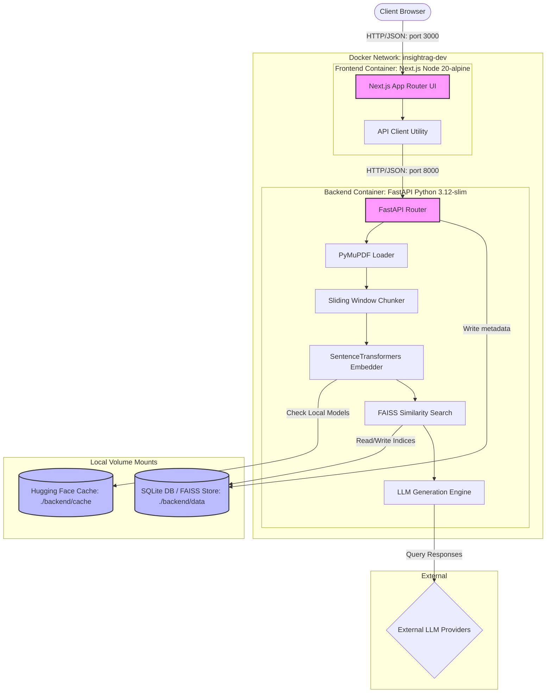
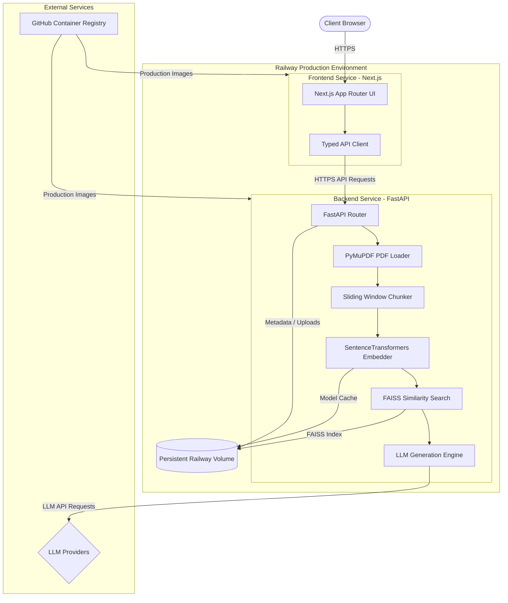

# InsightRAG Architecture & System Design

InsightRAG is an open-source Retrieval-Augmented Generation (RAG) platform that processes technical PDF documents to provide citation-backed answers. This document outlines the application's components, data flows, and deployment architectures.

---

## 1. System Design Principles

InsightRAG is designed with the following core engineering principles:
*   **Separation of Concerns**: Decoupled Next.js client-facing UI and FastAPI server API.
*   **Local Ingestion Execution**: Embedded embeddings generation and vector indexes running directly within the container runtime to avoid third-party ingestion service dependencies.
*   **Persistent Isolation**: Hardened privilege separation at boot with persistent volume mounting.

---

## 2. Ingestion & RAG Ingestion Flow

The application executes a structured pipeline to convert uploaded documents into searchable context:

```text
[PDF Upload]
     ↓ (HTTP POST /documents/upload)
[Text Ingestion]
     ↓ (PyMuPDF extracts raw text and preserves page boundaries)
[Text Chunking]
     ↓ (Sliding window cuts overlapping segments based on configuration)
[Vector Generation]
     ↓ (SentenceTransformers embeds chunks into 384-dimensional dense vectors)
[FAISS Indexing]
     ↓ (L2 normalized vectors stored in FAISS flat index)
[Context Retrieval]
     ↓ (Cosine similarity retrieval matches top context vectors)
[Response Synthesis]
     ↓ (LLM formats answers citing exact source document page numbers)
```

---

## 3. Technology Stack & Component Responsibilities

InsightRAG consists of several major layers working in tandem:

| Component | Technology | Responsibility |
| :--- | :--- | :--- |
| **Next.js Frontend** | Next.js 14.2.5 (React 18 / TS) | Renders the dashboard UI, chat conversation threads, upload forms, and citation preview modals. |
| **API Client** | Typed Fetch-based utility | Handles client-to-API network requests, headers, and type validation. |
| **FastAPI Backend** | FastAPI (Python 3.12) | Exposes REST endpoints, validates schemas via Pydantic, and coordinates SQLite/FAISS services. |
| **PyMuPDF (`fitz`)** | PyMuPDF | Extracts text contents page-by-page from raw uploaded PDF files. |
| **Text Chunker** | Sliding Window algorithm | Segments parsed text into smaller chunks based on configurable size and overlap parameters. |
| **SentenceTransformers** | `all-MiniLM-L6-v2` | Encodes chunk snippets locally into 384-dimensional vector coordinate arrays. |
| **FAISS Vector Store** | `IndexFlatIP` | Indexes normalized embeddings and performs fast cosine similarity lookups. |
| **LLM Providers** | OpenAI / Gemini / Groq / Ollama | Generates natural language answers strictly grounded in context snippets. |
| **SQLite Database** | SQLite & SQLAlchemy ORM | Maintains relational records of documents, processing states, chunks, and metadata. |
| **Railway Volume** | Attached Cloud Volume (5GB) | Hosts persistent directories for uploads, indices, database files, and Hugging Face model weights. |
| **GHCR** | GitHub Container Registry | Serves as the repository's production Docker image registry. |

---

## 4. Local vs. Production Architectures

### Local Development Architecture (Docker Compose)
In the local development environment, all processes are executed inside a local Docker network (`insightrag-dev`). Directories are mounted into the containers to support hot-reloading.



### Production Cloud Architecture (Railway)
In production, the frontend and backend operate as decoupled, standalone cloud services on Railway. The backend service mounts a persistent Railway volume to `/app/data` to host database records and index binaries.



---

## 5. Production Request Flow

When an end-user submits a prompt or uploads a document in production, execution triggers the following sequential loop:

1.  **Request Dispatch**: The user browser makes HTTPS requests to the frontend UI (`https://insightrag.up.railway.app`).
2.  **API Routing**: The UI invokes network requests via the API client pointing to the backend API (`https://insightrag-backend-production.up.railway.app`).
3.  **Document Ingestion**:
    *   For document uploads: Text is extracted via PyMuPDF, segmented by the sliding-window chunker, converted to dense embeddings vectors using SentenceTransformers, and written into the SQLite database and FAISS index stored on the persistent Railway volume (`/app/data`).
4.  **Retrieval & LLM Formulation**:
    *   For chat queries: The question is converted into a 384D query vector, searched against the FAISS index, and the top relevant metadata chunks are formatted into a grounded prompt context.
5.  **Answer Synthesis**: The backend issues an HTTPS call to the configured LLM provider (OpenAI, Gemini, or Groq) to synthesize an answer referencing source document page numbers.
6.  **Citation Rendering**: The JSON response payload is parsed by the frontend client to render page-level inline badges and display text preview modals.

---

## 6. Future Architectural Roadmap

Planned improvements for scalability and monitoring include:
*   **Phase 2.4 (Security & Monitoring)**: Automate CVE image vulnerability scans in the GHA pipelines, add production application logs, and configure metrics monitoring.
*   **Phase 3 (Production Scaling)**: Migrate SQLite metadata to a standalone PostgreSQL database, move vector indexes to a distributed vector store, and optimize index tree traversal.
